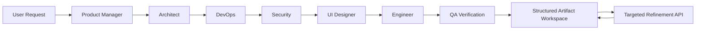

# BluePrinta 🏗️

[](https://github.com/josephsenior/BluePrinta/actions/workflows/ci.yml)
[](LICENSE)
[](https://www.typescriptlang.org/)
[](https://nextjs.org/)
[](https://tailwindcss.com/)
[](https://www.prisma.io/)
[](CONTRIBUTING.md)
[](https://github.com/josephsenior/BluePrinta/stargazers)
[](https://github.com/josephsenior/BluePrinta/network/members)

<div align="center">

## Multi-Agent SDLC Planning & Structured UI Generation

**BluePrinta** coordinates seven specialized AI roles across product planning, architecture, infrastructure, security, UI/UX, implementation, and QA.

Instead of ending with a long agent transcript, BluePrinta turns model outputs into **validated, structured artifacts** that can be rendered, refined, streamed, persisted, and exported.

> **Project status:** active beta and reference implementation. Local use requires your own Gemini API key and self-managed data storage; this repository is not a hosted service.

[⚡ Quick Start](#-quick-start) · [✨ Features](#-key-features) · [🏗️ Architecture](#️-architecture) · [📚 Documentation](#-documentation) · [🤝 Contributing](#-contributing) · [🗺️ Roadmap](#️-roadmap)

</div>

---

## 🌟 Why BluePrinta?

A software idea usually crosses multiple disciplines before implementation: product requirements, architecture, infrastructure, security, UI design, engineering planning, and QA.

BluePrinta models that process as a structured multi-agent pipeline.

Its core design goal is **artifact continuity**:

- upstream decisions remain available to downstream agents
- agent outputs are validated against schemas
- structured outputs can become interactive UI
- narrow artifact edits do not require full-pipeline regeneration
- long-running generation is observable from the frontend

---

## Key Features

### 🧩 Seven specialized AI roles

1. **Product Manager** — user stories and acceptance criteria
2. **Architect** — API contracts, database schemas, and ADRs
3. **DevOps Infrastructure** — CI/CD and infrastructure planning
4. **Security Architecture** — threat modeling and security controls
5. **UI Designer** — design tokens and component hierarchies
6. **Engineer Implementation** — file structures and implementation plans
7. **QA Verification** — test strategies and verification plans

### 🎯 Tool-based artifact refinement

Edit artifact JSON through predefined operations such as:

- `set_at_path`
- `add_array_item`

The refinement API updates targeted artifact regions instead of rerunning the complete agent pipeline.

```http
POST /api/diagrams/artifacts/edit
```

This keeps narrow edits explicit and avoids unnecessary regeneration.

### 🧱 Schema-driven structured outputs

Agent outputs are validated against Zod schemas and machine-readable JSON structures before becoming application artifacts.

That structure enables:

- predictable rendering
- downstream agent context
- targeted refinement
- artifact export
- stronger failure detection than free-form prose alone

### 🎨 Structured UI generation

Upstream agent outputs are converted into interactive React views rather than being exposed only as raw JSON or chat transcripts.

### ⚡ Generation jobs + SSE

Long-running generation is represented as jobs, while progress is streamed to the UI through **Server-Sent Events**.

### 🧠 Context-aware orchestration

Each role receives the relevant artifacts produced earlier in the pipeline so architectural and implementation decisions can remain connected.

### 💾 Gemini context caching

The orchestration layer uses Gemini context caching to reduce repeated prompt context across generation flows.

### 📤 Documentation exports

Generated artifacts can be exported as:

- Markdown
- PDF
- HTML
- PPTX

### 💿 Draft persistence

Prompts, settings, and uploads persist across reloads on the creation flow.

### 👤 Guest support

Limited diagram generation is available for non-authenticated sessions with session tracking.

---

## 🏗️ Architecture



### Agent pipeline

| Stage | Primary output |
|---|---|
| Product Manager | User stories, requirements, acceptance criteria |
| Architect | API contracts, schemas, ADRs |
| DevOps | Infrastructure and CI/CD design |
| Security | Threat model and security controls |
| UI Designer | Tokens, layouts, component structure |
| Engineer | File structure and implementation plan |
| QA | Test strategy and verification plan |

### Key components

- **Orchestrator** — runs agents in sequence and forwards upstream artifacts
- **Execution service** — handles timeouts, retries, and execution errors
- **Artifact schemas** — enforce structured agent output contracts
- **Refinement API** — applies tool-based targeted edits
- **Generation jobs** — represent long-running orchestration work
- **SSE streaming** — surfaces progress to the frontend
- **Prisma + SQLite** — local development persistence

---

## 🛠️ Getting Started

### ⚡ Quick Start

```bash
# Clone the repository
git clone https://github.com/josephsenior/BluePrinta.git
cd BluePrinta

# Install dependencies
pnpm install

# Configure the environment
cp .env.example .env

# Create the local SQLite database
pnpm db:generate
pnpm db:push

# Run the development server
pnpm dev
```

Open `http://localhost:3000`.

### Prerequisites

- **Node.js 18+**
- **pnpm**
- **Gemini API key**
- **Git**

### Configuration

Create `.env` from `.env.example` and add a Google AI key:

```env
GOOGLE_AI_API_KEY="your-google-ai-api-key"
DATABASE_URL="file:./prisma/local.db"

METASOP_LLM_PROVIDER="gemini"
METASOP_LLM_MODEL="gemini-3.5-flash"
```

> The codebase currently retains some legacy `METASOP_*` environment-variable names for runtime compatibility after the BluePrinta rename.

Optional agent controls:

```env
# METASOP_AGENT_TIMEOUT=300000
# METASOP_AGENT_RETRIES=2
```

---

## 🧪 Testing & Development

The CI workflow installs dependencies, type-checks, lints, runs the Vitest suite, and performs a production build.

```bash
# Development
pnpm dev

# Type checking
pnpm type-check

# Lint
pnpm lint
pnpm lint:fix

# Unit tests
pnpm test
pnpm test:watch
pnpm test:coverage
pnpm test:ui

# Production build
pnpm build
pnpm start
```

### Integration workflows

```bash
npx tsx tests/integration/verify_full_pipeline.ts
npx tsx tests/integration/test_cascading_refinement.ts
```

With a custom model:

```bash
METASOP_LLM_MODEL=gemini-3-pro-preview \
npx tsx tests/integration/verify_full_pipeline.ts
```

On Windows, `pnpm build` may encounter an **EPERM symlink** error when Next.js generates `.next/standalone`. See the [troubleshooting guide](docs/TROUBLESHOOTING.md#build-pnpm-build-fails-with-eperm-symlink-windows).

---

## 📚 Documentation

| Guide | Description |
|---|---|
| **[Documentation Hub](docs/index.md)** | Full documentation index and learning path |
| [Setup Guide](docs/SETUP.md) | Install, configure, and run locally |
| [Architecture](docs/ARCHITECTURE.md) | System design and agent pipeline |
| [API Reference](docs/API.md) | REST endpoints and examples |
| [LLM Configuration](docs/LLM-PROVIDERS.md) | Gemini setup and model selection |
| [Deployment](docs/DEPLOYMENT.md) | Deployment guidance |
| [Testing](docs/TESTING.md) | Unit and integration testing |
| [Troubleshooting](docs/TROUBLESHOOTING.md) | Common issues and fixes |
| [Contributing](CONTRIBUTING.md) | Contribution workflow |

---

## 🤝 Contributing

Contributions are welcome.

1. Fork the repository
2. Create a feature branch

```bash
git checkout -b feature/my-feature
```

3. Make the change
4. Run the relevant checks

```bash
pnpm test
pnpm type-check
pnpm lint
```

5. Commit and push

```bash
git add .
git commit -m "feat: add my feature"
git push origin feature/my-feature
```

6. Open a pull request

See [CONTRIBUTING.md](CONTRIBUTING.md) for the full workflow.

---

## 🗺️ Roadmap

### Implemented

- [x] Multi-agent SDLC orchestration
- [x] Tool-based artifact refinement
- [x] Structured Zod validation
- [x] Interactive web interface
- [x] SSE generation progress
- [x] Gemini context caching
- [x] Documentation exports
- [x] Draft persistence
- [x] Guest generation flows

### Next

- [ ] Additional LLM providers
- [ ] Deeper analytics and generation insights
- [ ] Extended artifact editing operations
- [ ] Stronger evaluation of cross-agent consistency
- [ ] Enterprise authentication and audit capabilities

See [ROADMAP.md](ROADMAP.md) for the detailed roadmap.

---

## 📜 License

Distributed under the MIT License. See [LICENSE](LICENSE).

---

## 🙏 Acknowledgments

Built with:

- [Next.js](https://nextjs.org/)
- [Google Gemini](https://ai.google.dev/)
- [Prisma](https://www.prisma.io/)
- [Radix UI](https://www.radix-ui.com/)
- [Tailwind CSS](https://tailwindcss.com/)
- [Vitest](https://vitest.dev/)

---

<div align="center">

**Built as an experiment in turning multi-agent planning into structured, editable software artifacts.**

⭐ If the architecture is useful to you, consider starring the repository.

</div>
