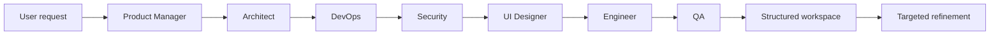

# BluePrinta

> Multi-agent SDLC planning and structured UI generation from a single software idea.

[](LICENSE)
[](https://www.typescriptlang.org/)
[](https://nextjs.org/)
[](https://vitest.dev/)

BluePrinta coordinates seven specialized AI roles across product planning, architecture, infrastructure, security, UI/UX, implementation, and QA. It turns structured agent outputs into a browsable software-design workspace and supports targeted artifact refinement without regenerating the entire pipeline.

## Why BluePrinta

Most multi-agent demos stop at a transcript. BluePrinta treats agent outputs as structured artifacts that can be validated, rendered, refined, exported, and passed downstream.

The pipeline covers:

1. **Product Manager** — user stories and acceptance criteria
2. **Architect** — API contracts, database schemas, and ADRs
3. **DevOps** — infrastructure and CI/CD planning
4. **Security** — threat modeling and security controls
5. **UI Designer** — design tokens and component hierarchies
6. **Engineer** — file structures and implementation plans
7. **QA** — test strategies and verification plans

## Core capabilities

- **Schema-driven artifacts** — agent outputs are validated with Zod and stored as structured JSON.
- **Targeted refinement** — update artifacts with predefined operations such as `set_at_path` and `add_array_item` instead of rerunning the full pipeline.
- **Interactive UI generation** — structured outputs are rendered into React interfaces rather than shown only as raw model text.
- **Generation jobs + SSE** — long-running work is queued and progress is streamed with Server-Sent Events.
- **Context-aware orchestration** — downstream agents receive relevant upstream artifacts.
- **Gemini context caching** — reduces repeated prompt context across long generation flows.
- **Export workflows** — generated documentation can be exported to Markdown, PDF, HTML, or PPTX.
- **Local persistence** — SQLite-backed development setup with Prisma.

## Architecture



The orchestration pipeline is sequential, but artifact refinement is tool-based. A user can modify a specific path or array item without asking the complete agent pipeline to regenerate every artifact.

## Quick start

### Prerequisites

- Node.js 18+
- `pnpm`
- A Google AI / Gemini API key
- Git

### Install

```bash
git clone https://github.com/josephsenior/BluePrinta.git
cd BluePrinta

pnpm install
cp .env.example .env
```

Add your API key to `.env`:

```env
GOOGLE_AI_API_KEY="your-google-ai-api-key"
DATABASE_URL="file:./prisma/local.db"
```

The repository currently retains some legacy `METASOP_*` configuration variable names for runtime compatibility. See `.env.example` for the supported options.

Initialize the local database and start the app:

```bash
pnpm db:generate
pnpm db:push
pnpm dev
```

Open `http://localhost:3000`.

## Development

```bash
pnpm type-check
pnpm lint
pnpm test
pnpm test:coverage
pnpm build
```

Integration workflows under `tests/integration/` can be run separately:

```bash
npx tsx tests/integration/verify_full_pipeline.ts
npx tsx tests/integration/test_cascading_refinement.ts
```

## Key implementation ideas

### Structured generation

Agent outputs are validated against explicit schemas before they become application artifacts. This keeps the UI and downstream pipeline dependent on machine-readable structures rather than free-form model prose.

### Targeted artifact editing

The artifact-edit API accepts predefined operations such as:

- `set_at_path`
- `add_array_item`

This makes refinement deterministic and avoids paying the latency and context cost of a full pipeline rerun for a narrow edit.

### Streaming long-running work

Generation runs as jobs, while SSE streams progress back to the interface. The UI can represent pipeline state without holding a single blocking request open for the complete generation lifecycle.

## Documentation

- [Documentation hub](docs/index.md)
- [Setup guide](docs/SETUP.md)
- [Architecture](docs/ARCHITECTURE.md)
- [API reference](docs/API.md)
- [LLM configuration](docs/LLM-PROVIDERS.md)
- [Deployment](docs/DEPLOYMENT.md)
- [Testing](docs/TESTING.md)
- [Troubleshooting](docs/TROUBLESHOOTING.md)
- [Contributing](CONTRIBUTING.md)

## Status

BluePrinta is an open-source engineering project focused on structured multi-agent SDLC workflows and artifact-driven refinement. The current implementation is primarily Gemini-backed; additional provider support remains future work.

## License

MIT — see [LICENSE](LICENSE).
